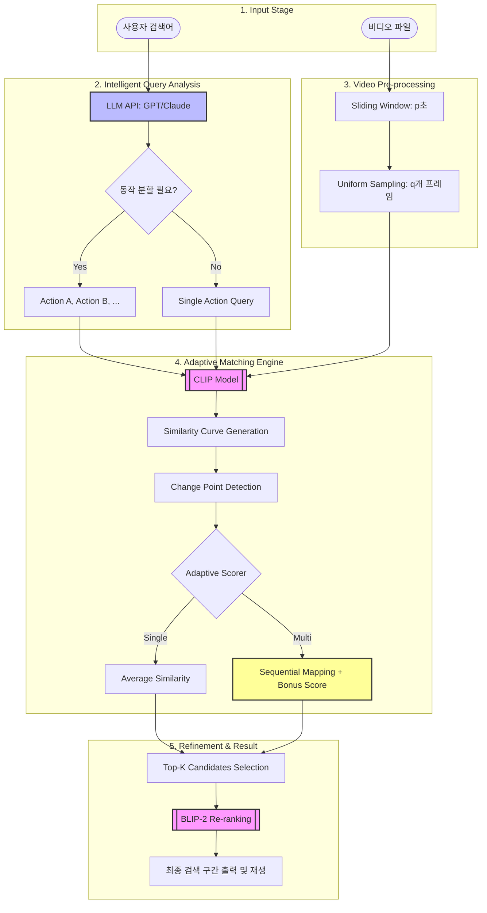

# 🎬 Adaptive Video Search Engine

**자연어 쿼리 기반 지능형 비디오 검색 시스템**

사용자가 자연어로 입력한 검색어를 기반으로 비디오에서 해당 장면을 정확하게 찾아주는 AI 기반 검색 엔진입니다. 단순 키워드 매칭이 아닌, 멀티모달 AI 모델을 활용하여 시맨틱(의미론적) 이해를 통해 복잡한 동작 시퀀스까지 탐지할 수 있습니다.

---

## 🌟 주요 기능

### 1. **지능형 쿼리 분석 (Intelligent Query Analysis)**

- **Gemini API 기반 한국어 쿼리 분석**: 사용자의 자연어 검색어를 시간 순서에 따른 동작(Action Sequence)으로 자동 분할
- **예시**:
  - "공을 던지고 나서 넘어지는 사람" → ["Person throwing a ball", "Person falling down"]
  - "웃고 있는 아기" → ["Baby laughing"] (분할 불필요)
- Fallback 메커니즘: API 실패 시 규칙 기반 분할 로직 자동 전환

### 2. **적응형 매칭 엔진 (Adaptive Matching Engine)**

- **단일 동작 검색**: CLIP 모델을 사용한 평균 유사도 기반 매칭
- **연속 동작 검색**: 변곡점(Change Point) 탐지를 통한 시퀀셜 매칭
  - 동작 A → 동작 B 전환 시점을 자동으로 찾아 최적의 구간 선별
  - 양쪽 동작의 유사도를 모두 고려한 복합 점수 산출

### 3. **2단계 검색 파이프라인 (Two-Stage Search)**

- **1차 검색 (Coarse-grained)**: CLIP 기반 고속 스캔으로 전체 비디오 탐색
- **2차 보정 (Fine-grained)**: BLIP-2 캡션 생성 및 의미적 유사도 검증으로 정확도 향상

### 4. **효율적인 프레임 샘플링**

- Sliding Window 방식으로 비디오를 p초 단위로 분할
- 각 윈도우에서 q개의 프레임을 균일하게 샘플링
- 메모리 효율적 처리 (GPU 지원)

---

## 🏗️ 시스템 아키텍처



---

## 🚀 설치 방법

### 1. 필수 패키지 설치

```bash
pip install torch transformers opencv-python pillow numpy google-genai openai python-dotenv
```

**보안 관련 에러 발생 시:**

```bash
pip install --upgrade torch torchvision torchaudio
```

### 2. 환경 변수 설정

프로젝트 루트에 `.env` 파일을 생성하고 Gemini API 키를 추가하세요:

```env
GEMINI_API_KEY=your_gemini_api_key_here
```

**API 키 발급:**

- [Google AI Studio](https://aistudio.google.com/app/apikey)에서 결제 수단만 추가 시 무료로 발급 가능

---

## 📖 사용 방법

### 기본 실행

```bash
python main.py
```

실행 시 BLIP-2 사용 여부를 선택할 수 있습니다:

```
BLIP-2 사용 여부 (True/False): False
```

### 설정 변경

`main.py` 파일의 `main()` 함수 내에서 다음 파라미터를 조정할 수 있습니다:

```python
# 비디오 및 검색어 설정
VIDEO_PATH = "sample_video.mp4"
QUERY = "바닥에 떨어진 신용카드"

# 실험 파라미터
p_list = [2.0, 4.0]      # 윈도우 크기 (초)
q_list = [24, 48]         # 샘플링 프레임 수
k_list = [3, 5]          # Top-K 개수
USE_BLIP = False         # BLIP-2 사용 여부
WEIGHT_CLIP = 0.7        # CLIP 점수 가중치
WEIGHT_SEMANTIC = 0.3    # 시맨틱 유사도 가중치
USE_LOOP = False         # 반복 실험 여부
```

---

## 🔧 파라미터 설명

| 파라미터            | 설명                                | 권장값                                |
| ------------------- | ----------------------------------- | ------------------------------------- |
| `p`               | 윈도우 크기 (초)                    | 2.0 ~ 4.0                             |
| `q`               | 윈도우당 샘플링 프레임 수           | 24 ~ 48                               |
| `k`               | 반환할 상위 후보 개수               | 3 ~ 5                                 |
| `USE_BLIP`        | BLIP-2 사용 여부 (메모리 4GB+ 필요) | False (빠른 검색), True (정확도 향상) |
| `WEIGHT_CLIP`     | CLIP 점수 가중치                    | 0.7                                   |
| `WEIGHT_SEMANTIC` | BLIP-2 시맨틱 점수 가중치           | 0.3                                   |

**하드웨어 권장 사양:**

- GPU: NVIDIA GPU with 6GB+ VRAM (BLIP-2 사용 시)
- CPU: 4 코어 이상
- RAM: 8GB 이상 (BLIP-2 사용 시 16GB 권장)

---

## 📊 출력 형식

검색 결과는 JSON 파일로 저장됩니다:

```json
{
  "meta": {
    "video_path": "sample_video.mp4",
    "query": "바닥에 떨어진 신용카드",
    "sub_queries": ["Credit card falling on the ground"],
    "split_reason": "[Gemini API] 단일 동작/상태를 묘사하는 쿼리로 분할하지 않았습니다.",
    "parameters": {"p": 2.0, "q": 24, "k": 3},
    "model": "Clip",
    "timestamp": "20260121_014931"
  },
  "results": [
    {
      "start": 10.5,
      "end": 12.5,
      "timestamp": "0:00:10 - 0:00:12",
      "raw_score": 0.387,
      "clip_score_norm": 74.8,
      "frame_scores": {
        "query_0": [0.35, 0.39, 0.41, ...],
        "best_split_index": null
      },
      "blip_caption": "A credit card falling on the floor",
      "semantic_consistency": 0.82,
      "final_score": 76.7
    }
  ]
}
```

---

## 🧩 핵심 컴포넌트

### 1. **ModelManager**

- CLIP 및 BLIP-2 모델 로딩 및 관리
- GPU/CPU 자동 감지 및 할당
- 코사인 유사도 계산 및 텍스트 임베딩 생성

### 2. **VideoProcessor**

- 비디오 로딩 및 메타데이터 추출 (FPS, 총 프레임 수 등)
- 윈도우 기반 프레임 추출 및 샘플링

### 3. **AdaptiveSearchEngine**

- 쿼리 분석 및 동작 분할 (`split_query`)
- 변곡점 탐지를 통한 시퀀셜 점수 계산 (`calculate_sequential_score`)
- 2단계 검색 파이프라인 실행 (`search`)
- 점수 정규화 (0-100 스케일)

---

## 🎯 검색 알고리즘 상세

### 점수 정규화

CLIP의 원시 코사인 유사도를 0-100 스케일로 변환:

```math
{Normalized Score} = \frac{\text{Raw Score} - 0.2}{0.45 - 0.2} \times 100
```

- **0.2 이하**: 0점
- **0.45 이상**: 100점
- **클리핑**: 0-100 범위로 제한

### 변곡점 탐지 (Sequential Matching)

쿼리가 [A, B]로 분할된 경우:

1. 각 프레임에 대해 A 유사도와 B 유사도를 계산
2. 윈도우의 20%-80% 구간에서 최적 분할 지점 탐색
3. t 시점 기준: `score = (avg(A[:t]) + avg(B[t:])) / 2`
4. 최대 점수를 갖는 t를 변곡점으로 선정

---

## 🛠️ 기술 스택

- **Vision Models**: OpenAI CLIP (ViT-B/32), Salesforce BLIP-2 (OPT-2.7B)
- **LLM API**: Google Gemini 2.0 Flash Lite
- **Deep Learning**: PyTorch, Transformers (Hugging Face)
- **Computer Vision**: OpenCV, Pillow
- **Others**: NumPy, python-dotenv

---

## 📝 예제 쿼리

| 쿼리                                    | 분할 결과                    | 매칭 방식   |
| --------------------------------------- | ---------------------------- | ----------- |
| "웃고 있는 아기"                        | 분할 없음                    | 단일 동작   |
| "공을 던지고 나서 넘어지는 사람"        | [던지는 동작, 넘어지는 동작] | 시퀀셜 매칭 |
| "요리를 하다가 불이 나서 당황하는 남자" | [요리 동작, 당황 동작]       | 시퀀셜 매칭 |
| "바닥에 떨어진 신용카드"                | 분할 없음                    | 단일 동작   |

---

## 🐛 문제 해결

### 1. Gemini API 오류

```
Gemini API Error: ... Switching to Fallback.
```

- `.env` 파일의 API 키가 올바른지 확인
- 인터넷 연결 상태 확인
- 시스템이 자동으로 규칙 기반 분할로 전환됨 (정상 동작)

### 2. GPU 메모리 부족

```
CUDA out of memory
```

- `USE_BLIP = False`로 설정하여 BLIP-2 비활성화
- `q` 값을 줄여서 프레임 샘플링 수 감소

### 3. PyTorch 보안 관련 에러

```bash
pip install --upgrade torch torchvision torchaudio
```

---

## 📄 라이센스

이 프로젝트는 교육 목적으로 작성되었습니다.

---

## 👥 기여

YAI Winter Project 2026-1학기

---

## 🔗 참고 자료

- [CLIP Paper](https://arxiv.org/abs/2103.00020) - Learning Transferable Visual Models From Natural Language Supervision
- [BLIP-2 Paper](https://arxiv.org/abs/2301.12597) - Bootstrapping Language-Image Pre-training with Frozen Image Encoders
- [Google Gemini API](https://ai.google.dev/)
