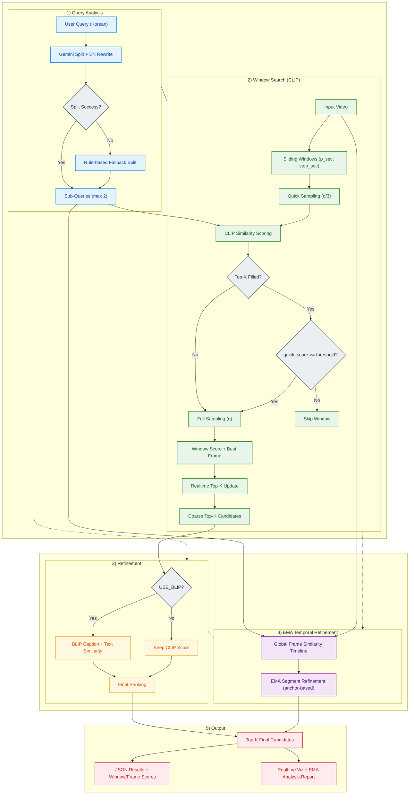

# Adaptive Video Search Engine (EMA Refined)

자연어 쿼리로 영상 구간을 찾는 멀티모달 검색 파이프라인입니다.
현재 준최종 로직은 `EMA_Refined_Video_Search.ipynb` 기준입니다.

## What This Version Implements

- Gemini 기반 쿼리 분할/영문화 (`split_query`)
- API 실패 시 규칙 기반 fallback 분할
- Sliding window + 2단계 샘플링(q/3 → q)
- Top-K 채워진 뒤 조기 스킵 필터링(임계값 = Top-K 최하위 점수의 70%)
- CLIP 기반 1차 점수화
  - 단일 쿼리: 프레임별 최대 유사도의 윈도우 최대값
  - 시퀀셜 쿼리(최대 2개): 각 쿼리 최고 프레임 점수 평균
- BLIP-2 기반 2차 보정(옵션)
- 전체 프레임 유사도 타임라인 기반 EMA 구간 추정 (`compute_ema_segments`)
- 실시간 Top-K 시각화 + EMA 상세 분석 리포트 저장

## Pipeline

1. Query 분석

- 한국어 쿼리를 Gemini로 최대 2개 동작으로 분할하고 CLIP 친화 영어 문장으로 변환
- 실패 시 접속사 규칙(`그리고`, `나서`, `하다가` 등)으로 1회 분할

2. 1차 검색 (CLIP)

- `p_sec` 길이 window를 `step_sec` 간격으로 이동
- 모든 window에 대해 먼저 q/3 프레임으로 quick score 계산
- Top-K가 채워지면 filtering mode 활성화
- quick score가 임계값 미만이면 해당 window 스킵
- 통과한 window만 full q 프레임으로 정밀 계산

3. 2차 보정 (선택)

- `USE_BLIP=True`일 때 Top-K 후보에 대해 캡션 생성 + 텍스트 유사도 계산
- 최종 점수: `final_score = clip_score * weight_clip + semantic_score * weight_semantic`

4. EMA 구간 보정

- 전체 프레임 유사도(기본 `frame_stride=2`, `batch_size=48`)를 미리 계산/재활용
- Top-K anchor 기준 좌/우 EMA 경계 추정
- 쿼리별/anchor별 상세 구간과 디버그 정보 저장

## Architecture


```mermaid
flowchart TB
    subgraph TOP[" "]
        direction LR
        subgraph QRY["1) Query Analysis"]
            A["User Query (Korean)"] --> B["Gemini Split + EN Rewrite"]
            B --> C{"Split Success?"}
            C -- "Yes" --> D["Sub-Queries (max 2)"]
            C -- "No" --> E["Rule-based Fallback Split"]
            E --> D
        end

        subgraph SRC["2) Window Search (CLIP)"]
            V["Input Video"] --> W["Sliding Windows (p_sec, step_sec)"]
            W --> X["Quick Sampling (q/3)"]
            D --> Y["CLIP Similarity Scoring"]
            X --> Y
            Y --> Z{"Top-K Filled?"}
            Z -- "No" --> F["Full Sampling (q)"]
            Z -- "Yes" --> G{"quick_score >= threshold?"}
            G -- "No" --> H["Skip Window"]
            G -- "Yes" --> F
            F --> I["Window Score + Best Frame"]
            I --> J["Realtime Top-K Update"]
            J --> K["Coarse Top-K Candidates"]
        end
    end

    subgraph BOTTOM[" "]
        direction LR
        subgraph REF["3) Refinement"]
            K --> L{"USE_BLIP?"}
            L -- "Yes" --> M["BLIP Caption + Text Similarity"]
            L -- "No" --> N["Keep CLIP Score"]
            M --> O["Final Ranking"]
            N --> O
        end

        subgraph EMA["4) EMA Temporal Refinement"]
            D --> P["Global Frame Similarity Timeline"]
            V --> P
            P --> Q["EMA Segment Refinement (anchor-based)"]
        end
    end

    QRY --- SRC
    REF --- EMA
    QRY -.-> REF
    SRC -.-> EMA

    subgraph OUT["5) Output"]
        O --> R["Top-K Final Candidates"]
        Q --> R
        R --> S["JSON Results + Window/Frame Scores"]
        R --> T["Realtime Viz + EMA Analysis Report"]
    end

    classDef query fill:#E3F2FD,stroke:#1E88E5,stroke-width:1.5px,color:#0D47A1;
    classDef search fill:#E8F5E9,stroke:#2E7D32,stroke-width:1.5px,color:#1B5E20;
    classDef refine fill:#FFF8E1,stroke:#F9A825,stroke-width:1.5px,color:#E65100;
    classDef ema fill:#F3E5F5,stroke:#8E24AA,stroke-width:1.5px,color:#4A148C;
    classDef output fill:#FFEBEE,stroke:#C62828,stroke-width:1.5px,color:#B71C1C;
    classDef decision fill:#ECEFF1,stroke:#455A64,stroke-width:1.5px,color:#263238;

    class A,B,D,E query;
    class V,W,X,Y,F,H,I,J,K search;
    class M,N,O refine;
    class P,Q ema;
    class R,S,T output;
    class C,Z,G,L decision;
```

## Core Classes

- `ModelManager`
  - CLIP(`openai/clip-vit-base-patch32`)
  - BLIP-2(`Salesforce/blip2-opt-2.7b`, optional)
  - 이미지-텍스트/텍스트-텍스트 유사도 계산

- `VideoProcessor`
  - 비디오 메타데이터(FPS, duration) 로드
  - window 프레임 추출, stride 프레임 iteration

- `AdaptiveSearchEngine`
  - 쿼리 분할, window 검색, Top-K 관리, BLIP 재정렬
  - EMA 기반 세그먼트 계산

- `RealTimeVisualizer`, `EMADropVisualizer`
  - 검색 진행/최종 Top-K 시각화
  - EMA anchor별 상세 리포트/그림 생성

## Requirements

노트북 기준 주요 패키지:

```bash
pip install transformers opencv-python pillow numpy google-genai python-dotenv matplotlib
pip install torch torchvision torchaudio --index-url https://download.pytorch.org/whl/cu121
pip install triton
pip install av --upgrade
```

## API Key

Gemini 사용을 위해 `GEMINI_API_KEY`가 필요합니다.

로컬 실행 시 `.env` 예시:

```env
GEMINI_API_KEY=your_key_here
```

노트북(Colab)에서는 `userdata.get('GEMINI_API_KEY')` 경로를 사용합니다.

## How To Run

현재 기준 실행 엔트리는 노트북입니다.

1. `EMA_Refined_Video_Search.ipynb` 열기
2. 모델/비디오 초기화 셀 실행
3. `main()` 설정값 수정 후 실행

`main()` 주요 설정:

```python
VIDEO_PATH = "/content/YAI_17_Winter_Project/sample_video.mp4"
SAVE_PATH = "results"
QUERY = "차를 운전하면서 대화하는 남자"

p_list = [2.0, 4.0]
q_list = [6, 12]
k_list = [3, 5]
STEP_SEC = 1.0

USE_BLIP = False
WEIGHT_CLIP = 0.7
WEIGHT_SEMANTIC = 0.3

ENABLE_EMA = True
EMA_ALPHA = 0.85
EMA_FRAME_STRIDE = 2
EMA_BATCH_SIZE = 48
EMA_MAX_DROP_SEGMENTS = 3

USE_LOOP = False
```

## Output Files

`results/` 아래에 저장됩니다.

- 메인 결과: `Clip_...json` 또는 `CB_...json`
  - `meta`, `time_used`, `results`, `ema`
- 전체 프레임 점수: `whole_frame_scores_...json`
- 전체 윈도우 점수: `whole_window_scores_...json` (반복 모드에서는 `whole_score_...json` 포맷도 사용)
- 실시간 시각화: `viz_...png`
- EMA 분석: `results/ema_analysis/`
  - `ema_segments_...png`
  - `ema_report_...txt`

## Parameter Guide

- `p`: window 길이(초)
- `q`: window당 샘플 프레임 수
- `k`: Top-K 개수
- `STEP_SEC`: window 이동 간격
- `USE_BLIP`: BLIP-2 재정렬 사용 여부
- `WEIGHT_CLIP`, `WEIGHT_SEMANTIC`: BLIP 사용 시 최종 점수 가중치
- `EMA_ALPHA`: EMA smoothing 계수
- `EMA_FRAME_STRIDE`: EMA 계산용 프레임 간격
- `EMA_BATCH_SIZE`: EMA 계산 배치 크기
- `EMA_MAX_DROP_SEGMENTS`: anchor당 하락 구간 탐색 수

## Notes

- 긴 영상에서는 filtering mode로 많은 window를 스킵해 속도 개선 효과가 큽니다.
- BLIP-2는 GPU 메모리 사용량이 높습니다. OOM 시 `USE_BLIP=False`, `q` 축소를 우선 권장합니다.
- 임시 썸네일은 실행 종료 시 `cleanup_temp_images()`로 정리됩니다.

## Project Files

- 준최종 노트북: `EMA_Refined_Video_Search.ipynb`
- 발전 기록: `PROJECT_EVOLUTION.md`
- 요약 문서: `IMPLEMENTATION_SUMMARY.md`
- 최적화 문서: `OPTIMIZATION_REPORT.md`
- 빠른 시작: `QUICK_START.md`

## License

교육/연구 목적 프로젝트.
